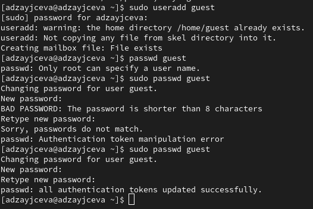
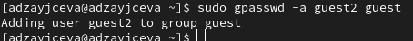
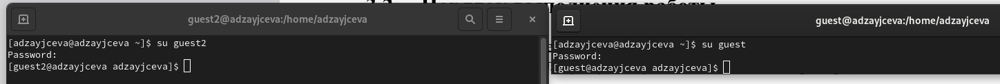
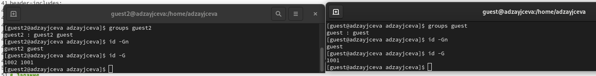
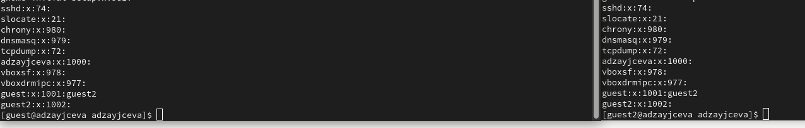
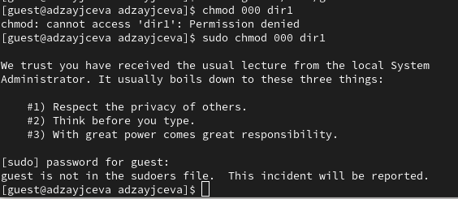

---
## Front matter
lang: ru-RU
title: Laboratory №3
author: |
	Anna D. Zaytseva\inst{1,3}
institute: |
	\inst{1}RUDN University, Moscow, Russian Federation
date: NEC--2024, 21 September, Moscow

## Formatting
toc: false
slide_level: 2
theme: metropolis
header-includes: 
 - \metroset{progressbar=frametitle,sectionpage=progressbar,numbering=fraction}
 - '\makeatletter'
 - '\beamer@ignorenonframefalse'
 - '\makeatother'
aspectratio: 43
section-titles: true
---

# Цель работы

Цель работы --- Получение практических навыков работы в консоли с атрибутами файлов для групп пользователей.

# Задание

- Последовательно выполнить все пункты (указанные в файле с заданием к лабораторной работе №3), занося ответы на поставленные вопросы и замечания в отчёт.

# Выполнение лабораторной работы

## Steps 1-3

Создала учётные записи пользователей guest и guest2 и добавила пользователя guest2 в группу guest с помощью команды `gpasswd -a guest2 guest`

{ #fig:001 width=70% }

{ #fig:002 width=70% }

{ #fig:003 width=70% }

## Steps 4-7

Осуществила вход в систему от двух пользователей на двух разных консолях: guest на первой консоли и guest2 на второй консоли с помощью команды `su <имя пользователя>` и проверила доступы с помощью нескольких команд:

{ #fig:004 width=70% }
{ #fig:005 width=70% }
{ #fig:006 width=70% }
{ #fig:007 width=70% }
{ #fig:008 width=70% }

## Steps 8-10

8) От имени пользователя guest2 выполнила регистрацию пользователя guest2 в группе guest командой `newgrp guest`; От имени пользователя guest изменила права директории /home/guest, разрешив все действия для пользователей группы: `chmod g+rwx /home/guest`; От имени пользователя guest сняла с директории /home/guest/dir1 все атрибуты командой `chmod 000 dir1`

{ #fig:009 width=70% }
{ #fig:010 width=70% }
{ #fig:011 width=70% }

## Step 11

Меняя атрибуты у директории dir1 и файла file1 от имени пользователя guest и делая проверку от пользователя guest2, заполнила таблицу 3.1:

| **Права  директории** | **Права  файла** | **Создание  файла** | **Удаление  файла** | **Запись  в файл** | **Чтение  файла** | **Смена  директории** | **Просмотр файлов  в директории** | **Переименование  файла** | **Смена  атрибутов файла** |
|:---------------------:|:----------------:|:-------------------:|:-------------------:|:------------------:|:-----------------:|:---------------------:|:---------------------------------:|:-------------------------:|:--------------------------:|
| 000                   | 000              | -                   | -                   | -                  | -                 | -                     | -                                 | -                         | -                          |
| 000                   | 010              | -                   | -                   | -                  | -                 | -                     | -                                 | -                         | -                          |
| 000                   | 020              | -                   | -                   | -                  | -                 | -                     | -                                 | -                         | -                          |
| 000                   | 030              | -                   | -                   | -                  | -                 | -                     | -                                 | -                         | -                          |
| 000                   | 040              | -                   | -                   | -                  | -                 | -                     | -                                 | -                         | -                          |
| 000                   | 050              | -                   | -                   | -                  | -                 | -                     | -                                 | -                         | -                          |
| 000                   | 060              | -                   | -                   | -                  | -                 | -                     | -                                 | -                         | -                          |
| 000                   | 070              | -                   | -                   | -                  | -                 | -                     | -                                 | -                         | -                          |
| 010                   | 000              | -                   | -                   | -                  | -                 | +                     | -                                 | -                         | -                          |
| 010                   | 010              | -                   | -                   | -                  | -                 | +                     | -                                 | -                         | -                          |
| 010                   | 020              | -                   | -                   | +                  | -                 | +                     | -                                 | -                         | -                          |
| 010                   | 030              | -                   | -                   | +                  | -                 | +                     | -                                 | -                         | -                          |
| 010                   | 040              | -                   | -                   | -                  | +                 | +                     | -                                 | -                         | -                          |
| 010                   | 050              | -                   | -                   | -                  | +                 | +                     | -                                 | -                         | -                          |
| 010                   | 060              | -                   | -                   | +                  | +                 | +                     | -                                 | -                         | -                          |
| 010                   | 070              | -                   | -                   | +                  | +                 | +                     | -                                 | -                         | -                          |
| 020                   | 000              | -                   | -                   | -                  | -                 | -                     | -                                 | -                         | -                          |
| 020                   | 010              | -                   | -                   | -                  | -                 | -                     | -                                 | -                         | -                          |
| 020                   | 020              | -                   | -                   | -                  | -                 | -                     | -                                 | -                         | -                          |
| 020                   | 030              | -                   | -                   | -                  | -                 | -                     | -                                 | -                         | -                          |
| 020                   | 040              | -                   | -                   | -                  | -                 | -                     | -                                 | -                         | -                          |
| 020                   | 050              | -                   | -                   | -                  | -                 | -                     | -                                 | -                         | -                          |
| 020                   | 060              | -                   | -                   | -                  | -                 | -                     | -                                 | -                         | -                          |
| 020                   | 070              | -                   | -                   | -                  | -                 | -                     | -                                 | -                         | -                          |
| 030                   | 000              | +                   | +                   | -                  | -                 | +                     | -                                 | +                         | -                          |
| 030                   | 010              | +                   | +                   | -                  | -                 | +                     | -                                 | +                         | -                          |
| 030                   | 020              | +                   | +                   | +                  | -                 | +                     | -                                 | +                         | -                          |
| 030                   | 030              | +                   | +                   | +                  | -                 | +                     | -                                 | +                         | -                          |
| 030                   | 040              | +                   | +                   | -                  | +                 | +                     | -                                 | +                         | -                          |
| 030                   | 050              | +                   | +                   | -                  | +                 | +                     | -                                 | +                         | -                          |
| 030                   | 060              | +                   | +                   | +                  | +                 | +                     | -                                 | +                         | -                          |
| 030                   | 070              | +                   | +                   | +                  | +                 | +                     | -                                 | +                         | -                          |
| 040                   | 000              | -                   | -                   | -                  | -                 | -                     | -                                 | -                         | -                          |
| 040                   | 010              | -                   | -                   | -                  | -                 | -                     | -                                 | -                         | -                          |
| 040                   | 020              | -                   | -                   | -                  | -                 | -                     | -                                 | -                         | -                          |
| 040                   | 030              | -                   | -                   | -                  | -                 | -                     | -                                 | -                         | -                          |
| 040                   | 040              | -                   | -                   | -                  | -                 | -                     | -                                 | -                         | -                          |
| 040                   | 050              | -                   | -                   | -                  | -                 | -                     | -                                 | -                         | -                          |
| 040                   | 060              | -                   | -                   | -                  | -                 | -                     | -                                 | -                         | -                          |
| 040                   | 070              | -                   | -                   | -                  | -                 | -                     | -                                 | -                         | -                          |
| 050                   | 000              | -                   | -                   | -                  | -                 | +                     | +                                 | -                         | -                          |
| 050                   | 010              | -                   | -                   | -                  | -                 | +                     | +                                 | -                         | -                          |
| 050                   | 020              | -                   | -                   | +                  | -                 | +                     | +                                 | -                         | -                          |
| 050                   | 030              | -                   | -                   | +                  | -                 | +                     | +                                 | -                         | -                          |
| 050                   | 040              | -                   | -                   | -                  | +                 | +                     | +                                 | -                         | -                          |
| 050                   | 050              | -                   | -                   | -                  | +                 | +                     | +                                 | -                         | -                          |
| 050                   | 060              | -                   | -                   | +                  | +                 | +                     | +                                 | -                         | -                          |
| 050                   | 070              | -                   | -                   | +                  | +                 | +                     | +                                 | -                         | -                          |
| 060                   | 000              | -                   | -                   | -                  | -                 | -                     | +                                 | -                         | -                          |
| 060                   | 010              | -                   | -                   | -                  | -                 | -                     | +                                 | -                         | -                          |
| 060                   | 020              | -                   | -                   | -                  | -                 | -                     | +                                 | -                         | -                          |
| 060                   | 030              | -                   | -                   | -                  | -                 | -                     | +                                 | -                         | -                          |
| 060                   | 040              | -                   | -                   | -                  | -                 | -                     | +                                 | -                         | -                          |
| 060                   | 050              | -                   | -                   | -                  | -                 | -                     | +                                 | -                         | -                          |
| 060                   | 060              | -                   | -                   | -                  | -                 | -                     | +                                 | -                         | -                          |
| 060                   | 070              | -                   | -                   | -                  | -                 | -                     | +                                 | -                         | -                          |
| 070                   | 000              | +                   | +                   | -                  | -                 | +                     | +                                 | +                         | -                          |
| 070                   | 010              | +                   | +                   | -                  | -                 | +                     | +                                 | +                         | -                          |
| 070                   | 020              | +                   | +                   | +                  | -                 | +                     | +                                 | +                         | -                          |
| 070                   | 030              | +                   | +                   | +                  | -                 | +                     | +                                 | +                         | -                          |
| 070                   | 040              | +                   | +                   | -                  | +                 | +                     | +                                 | +                         | -                          |
| 070                   | 050              | +                   | +                   | -                  | +                 | +                     | +                                 | +                         | -                          |
| 070                   | 060              | +                   | +                   | +                  | +                 | +                     | +                                 | +                         | -                          |
| 070                   | 070              | +                   | +                   | +                  | +                 | +                     | +                                 | +                         | -                          |

## Step 12
На основании заполненной таблицы определила те или иные минимально необходимые права для выполнения пользователем guest2 операций внутри директории dir1 и заполнила таблицу 3.2:

|      **Операция**      | **Минимальные права на директорию** | **Минимальные права на файл** |
|:----------------------:|:-----------------------------------:|:-----------------------------:|
| Создание файла         |               (-wx)(3)              |            (---)(0)           |
| Удаление файла         |               (-wx)(3)              |            (---)(0)           |
| Чтение файла           |               (--x)(1)              |            (r--)(4)           |
| Запись в файл          |               (--x)(1)              |            (-w-)(2)           |
| Переименование файла   |               (-wx)(3)              |            (---)(0)           |
| Создание поддиректории |               (-wx)(3)              |            (---)(0)           |
| Удаление поддиректории |               (-wx)(3)              |            (---)(0)           |

## Steps 13-14

Сохранила отчёт в 3 форматах: docx, pdf, md. Обновила данные на GitHub.

# Вывод

Я получила практические навыкы работы в консоли с атрибутами файлов для групп пользователей.

# Библиография

1. Медведовский И.Д., Семьянов П.В., Платонов В.В. Атака через Internet. — НПО "Мир и семья-95", 1997. — URL: http://bugtraq.ru/library/books/attack1/index.html
2. Медведовский И.Д., Семьянов П.В., Леонов Д.Г. Атака на Internet. — Издательство ДМК, 1999. — URL: http://bugtraq.ru/library/books/attack/index.html
3. Запечников С. В. и др. Информационн~пасность открытых систем. Том 1. — М.: Горячаая линия -Телеком, 2006.

## {.standout}

Спасибо за внимание!
