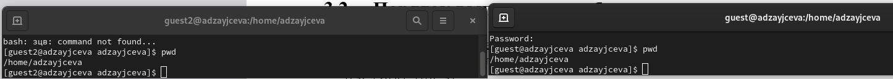

---
## Front matter
title: "Лабораторная работа №3"
subtitle: "Отчёт к лабораторной работе"
author: "Зайцева Анна Дмитриевна"

## Generic options
lang: ru-RU

## Bibliography
bibliography: bib/cite.bib
csl: pandoc/csl/gost-r-7-0-5-2008-numeric.csl

## Pdf output format
toc: true # Table of contents
toc-depth: 2
lof: true # List of figures
lot: true # List of tables
fontsize: 12pt
linestretch: 1.5
papersize: a4
documentclass: scrreprt
## Fonts
mainfont: PT Serif
romanfont: PT Serif
sansfont: PT Sans
monofont: PT Mono
mainfontoptions: Ligatures=TeX
romanfontoptions: Ligatures=TeX
sansfontoptions: Ligatures=TeX,Scale=MatchLowercase
monofontoptions: Scale=MatchLowercase,Scale=0.9
## Pandoc-crossref LaTeX customization
figureTitle: "Рис."
tableTitle: "Таблица"
listingTitle: "Листинг"
lofTitle: "Список иллюстраций"
lotTitle: "Список таблиц"
lolTitle: "Листинги"
## Misc options
indent: true
header-includes:
  - \usepackage{indentfirst}
  - \usepackage{float} # keep figures where there are in the text
  - \floatplacement{figure}{H} # keep figures where there are in the text
---

# Цель работы

Цель работы --- Получение практических навыков работы в консоли с атрибутами файлов для групп пользователей.

# Задание

- Последовательно выполнить все пункты (указанные в файле с заданием к лабораторной работе №3), занося ответы на поставленные вопросы и замечания в отчёт.

# Выполнение лабораторной работы

1) В установленной операционной системе создала учётную запись пользователя guest (используя учётную запись администратора) с помошью команды `useradd guest` и задала для этого же пользователя пароль с помощью команды `passwd guest` (Рис. [-@fig:001]):

{ #fig:001 width=70% }

2) Создала второго пользователя guest2 и также задала для него пароль  (Рис. [-@fig:002]):

{ #fig:002 width=70% }

3) Добавила пользователя guest2 в группу guest с помощью команды `gpasswd -a guest2 guest` (Рис. [-@fig:003]):

{ #fig:003 width=70% }

4) Осуществила вход в систему от двух пользователей на двух разных консолях: guest на первой консоли и guest2 на второй консоли с помощью команды `su <имя пользователя>` (Рис. [-@fig:004]):

{ #fig:004 width=70% }

5) Для обоих пользователей командой `pwd` определила директорию, в которой нахожусь. Предложения командной строки оказались одинаковыми (Рис. [-@fig:005]):

{ #fig:005 width=70% }

6) Уточнила имя пользователя, его группу, кто входит в неё и к каким группам принадлежит он сам. Определила командами `groups guest` и `groups guest2`, в какие группы входят пользователи guest и guest2. Сравнила вывод команды `groups` с выводом команд `id -Gn` и `id -G`: первая команда выводит имя пользователя и через двоеточие список его групп, вторая выводит только список групп, а третья выводит только числовые коды для этих групп (Рис. [-@fig:006]):

{ #fig:006 width=70% }

7) Сравнила полученную информацию с содержимым файла /etc/group, просмотрев файл командой `cat /etc/group` (Рис. [-@fig:007]-[-@fig:008]):

{ #fig:007 width=70% }
{ #fig:008 width=70% }

8) От имени пользователя guest2 выполнила регистрацию пользователя guest2 в группе guest командой `newgrp guest` (Рис. [-@fig:009]):

{ #fig:009 width=70% }

9) От имени пользователя guest изменила права директории /home/guest, разрешив все действия для пользователей группы: `chmod g+rwx /home/guest` (Рис. [-@fig:010]):

{ #fig:010 width=70% }

10) От имени пользователя guest сняла с директории /home/guest/dir1 все атрибуты командой `chmod 000 dir1` (Рис. [-@fig:011]):

{ #fig:011 width=70% }

11) Меняя атрибуты у директории dir1 и файла file1 от имени пользователя guest и делая проверку от пользователя guest2, заполнила таблицу 3.1:

| **Права  директории** | **Права  файла** | **Создание  файла** | **Удаление  файла** | **Запись  в файл** | **Чтение  файла** | **Смена  директории** | **Просмотр файлов  в директории** | **Переименование  файла** | **Смена  атрибутов файла** |
|:---------------------:|:----------------:|:-------------------:|:-------------------:|:------------------:|:-----------------:|:---------------------:|:---------------------------------:|:-------------------------:|:--------------------------:|
| 000                   | 000              | -                   | -                   | -                  | -                 | -                     | -                                 | -                         | -                          |
| 000                   | 010              | -                   | -                   | -                  | -                 | -                     | -                                 | -                         | -                          |
| 000                   | 020              | -                   | -                   | -                  | -                 | -                     | -                                 | -                         | -                          |
| 000                   | 030              | -                   | -                   | -                  | -                 | -                     | -                                 | -                         | -                          |
| 000                   | 040              | -                   | -                   | -                  | -                 | -                     | -                                 | -                         | -                          |
| 000                   | 050              | -                   | -                   | -                  | -                 | -                     | -                                 | -                         | -                          |
| 000                   | 060              | -                   | -                   | -                  | -                 | -                     | -                                 | -                         | -                          |
| 000                   | 070              | -                   | -                   | -                  | -                 | -                     | -                                 | -                         | -                          |
| 010                   | 000              | -                   | -                   | -                  | -                 | +                     | -                                 | -                         | -                          |
| 010                   | 010              | -                   | -                   | -                  | -                 | +                     | -                                 | -                         | -                          |
| 010                   | 020              | -                   | -                   | +                  | -                 | +                     | -                                 | -                         | -                          |
| 010                   | 030              | -                   | -                   | +                  | -                 | +                     | -                                 | -                         | -                          |
| 010                   | 040              | -                   | -                   | -                  | +                 | +                     | -                                 | -                         | -                          |
| 010                   | 050              | -                   | -                   | -                  | +                 | +                     | -                                 | -                         | -                          |
| 010                   | 060              | -                   | -                   | +                  | +                 | +                     | -                                 | -                         | -                          |
| 010                   | 070              | -                   | -                   | +                  | +                 | +                     | -                                 | -                         | -                          |
| 020                   | 000              | -                   | -                   | -                  | -                 | -                     | -                                 | -                         | -                          |
| 020                   | 010              | -                   | -                   | -                  | -                 | -                     | -                                 | -                         | -                          |
| 020                   | 020              | -                   | -                   | -                  | -                 | -                     | -                                 | -                         | -                          |
| 020                   | 030              | -                   | -                   | -                  | -                 | -                     | -                                 | -                         | -                          |
| 020                   | 040              | -                   | -                   | -                  | -                 | -                     | -                                 | -                         | -                          |
| 020                   | 050              | -                   | -                   | -                  | -                 | -                     | -                                 | -                         | -                          |
| 020                   | 060              | -                   | -                   | -                  | -                 | -                     | -                                 | -                         | -                          |
| 020                   | 070              | -                   | -                   | -                  | -                 | -                     | -                                 | -                         | -                          |
| 030                   | 000              | +                   | +                   | -                  | -                 | +                     | -                                 | +                         | -                          |
| 030                   | 010              | +                   | +                   | -                  | -                 | +                     | -                                 | +                         | -                          |
| 030                   | 020              | +                   | +                   | +                  | -                 | +                     | -                                 | +                         | -                          |
| 030                   | 030              | +                   | +                   | +                  | -                 | +                     | -                                 | +                         | -                          |
| 030                   | 040              | +                   | +                   | -                  | +                 | +                     | -                                 | +                         | -                          |
| 030                   | 050              | +                   | +                   | -                  | +                 | +                     | -                                 | +                         | -                          |
| 030                   | 060              | +                   | +                   | +                  | +                 | +                     | -                                 | +                         | -                          |
| 030                   | 070              | +                   | +                   | +                  | +                 | +                     | -                                 | +                         | -                          |
| 040                   | 000              | -                   | -                   | -                  | -                 | -                     | -                                 | -                         | -                          |
| 040                   | 010              | -                   | -                   | -                  | -                 | -                     | -                                 | -                         | -                          |
| 040                   | 020              | -                   | -                   | -                  | -                 | -                     | -                                 | -                         | -                          |
| 040                   | 030              | -                   | -                   | -                  | -                 | -                     | -                                 | -                         | -                          |
| 040                   | 040              | -                   | -                   | -                  | -                 | -                     | -                                 | -                         | -                          |
| 040                   | 050              | -                   | -                   | -                  | -                 | -                     | -                                 | -                         | -                          |
| 040                   | 060              | -                   | -                   | -                  | -                 | -                     | -                                 | -                         | -                          |
| 040                   | 070              | -                   | -                   | -                  | -                 | -                     | -                                 | -                         | -                          |
| 050                   | 000              | -                   | -                   | -                  | -                 | +                     | +                                 | -                         | -                          |
| 050                   | 010              | -                   | -                   | -                  | -                 | +                     | +                                 | -                         | -                          |
| 050                   | 020              | -                   | -                   | +                  | -                 | +                     | +                                 | -                         | -                          |
| 050                   | 030              | -                   | -                   | +                  | -                 | +                     | +                                 | -                         | -                          |
| 050                   | 040              | -                   | -                   | -                  | +                 | +                     | +                                 | -                         | -                          |
| 050                   | 050              | -                   | -                   | -                  | +                 | +                     | +                                 | -                         | -                          |
| 050                   | 060              | -                   | -                   | +                  | +                 | +                     | +                                 | -                         | -                          |
| 050                   | 070              | -                   | -                   | +                  | +                 | +                     | +                                 | -                         | -                          |
| 060                   | 000              | -                   | -                   | -                  | -                 | -                     | +                                 | -                         | -                          |
| 060                   | 010              | -                   | -                   | -                  | -                 | -                     | +                                 | -                         | -                          |
| 060                   | 020              | -                   | -                   | -                  | -                 | -                     | +                                 | -                         | -                          |
| 060                   | 030              | -                   | -                   | -                  | -                 | -                     | +                                 | -                         | -                          |
| 060                   | 040              | -                   | -                   | -                  | -                 | -                     | +                                 | -                         | -                          |
| 060                   | 050              | -                   | -                   | -                  | -                 | -                     | +                                 | -                         | -                          |
| 060                   | 060              | -                   | -                   | -                  | -                 | -                     | +                                 | -                         | -                          |
| 060                   | 070              | -                   | -                   | -                  | -                 | -                     | +                                 | -                         | -                          |
| 070                   | 000              | +                   | +                   | -                  | -                 | +                     | +                                 | +                         | -                          |
| 070                   | 010              | +                   | +                   | -                  | -                 | +                     | +                                 | +                         | -                          |
| 070                   | 020              | +                   | +                   | +                  | -                 | +                     | +                                 | +                         | -                          |
| 070                   | 030              | +                   | +                   | +                  | -                 | +                     | +                                 | +                         | -                          |
| 070                   | 040              | +                   | +                   | -                  | +                 | +                     | +                                 | +                         | -                          |
| 070                   | 050              | +                   | +                   | -                  | +                 | +                     | +                                 | +                         | -                          |
| 070                   | 060              | +                   | +                   | +                  | +                 | +                     | +                                 | +                         | -                          |
| 070                   | 070              | +                   | +                   | +                  | +                 | +                     | +                                 | +                         | -                          |

12) На основании заполненной таблицы определила те или иные минимально необходимые права для выполнения пользователем guest2 операций внутри директории dir1 и заполнила таблицу 3.2:

|      **Операция**      | **Минимальные права на директорию** | **Минимальные права на файл** |
|:----------------------:|:-----------------------------------:|:-----------------------------:|
| Создание файла         |               (-wx)(3)              |            (---)(0)           |
| Удаление файла         |               (-wx)(3)              |            (---)(0)           |
| Чтение файла           |               (--x)(1)              |            (r--)(4)           |
| Запись в файл          |               (--x)(1)              |            (-w-)(2)           |
| Переименование файла   |               (-wx)(3)              |            (---)(0)           |
| Создание поддиректории |               (-wx)(3)              |            (---)(0)           |
| Удаление поддиректории |               (-wx)(3)              |            (---)(0)           |

13) Сохранила отчёт в 3 форматах: docx, pdf, md.

14) Обновила данные на GitHub.

# Вывод

Я получила практические навыкы работы в консоли с атрибутами файлов для групп пользователей.

# Библиография

1. Медведовский И.Д., Семьянов П.В., Платонов В.В. Атака через Internet. — НПО "Мир и семья-95", 1997. — URL: http://bugtraq.ru/library/books/attack1/index.html
2. Медведовский И.Д., Семьянов П.В., Леонов Д.Г. Атака на Internet. — Издательство ДМК, 1999. — URL: http://bugtraq.ru/library/books/attack/index.html
3. Запечников С. В. и др. Информационн~пасность открытых систем. Том 1. — М.: Горячаая линия -Телеком, 2006.
