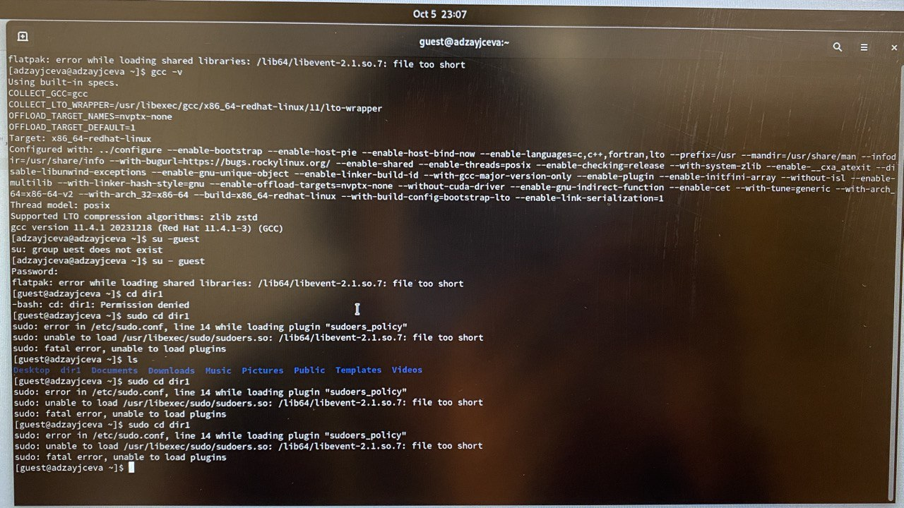

---
## Front matter
title: "Лабораторная работа №5"
subtitle: "Отчёт к лабораторной работе"
author: "Зайцева Анна Дмитриевна"

## Generic options
lang: ru-RU

## Bibliography
bibliography: bib/cite.bib
csl: pandoc/csl/gost-r-7-0-5-2008-numeric.csl

## Pdf output format
toc: true # Table of contents
toc-depth: 2
lof: true # List of figures
lot: true # List of tables
fontsize: 12pt
linestretch: 1.5
papersize: a4
documentclass: scrreprt
## Fonts
mainfont: PT Serif
romanfont: PT Serif
sansfont: PT Sans
monofont: PT Mono
mainfontoptions: Ligatures=TeX
romanfontoptions: Ligatures=TeX
sansfontoptions: Ligatures=TeX,Scale=MatchLowercase
monofontoptions: Scale=MatchLowercase,Scale=0.9
## Pandoc-crossref LaTeX customization
figureTitle: "Рис."
tableTitle: "Таблица"
listingTitle: "Листинг"
lofTitle: "Список иллюстраций"
lotTitle: "Список таблиц"
lolTitle: "Листинги"
## Misc options
indent: true
header-includes:
  - \usepackage{indentfirst}
  - \usepackage{float} # keep figures where there are in the text
  - \floatplacement{figure}{H} # keep figures where there are in the text
---

# Цель работы

Цель работы --- Изучение механизмов изменения идентификаторов, применения SetUID- и Sticky-битов. Получение практических навыков работы в консоли с дополнительными атрибутами. Рассмотрение работы механизма смены идентификатора процессов пользователей, а также влияние бита Sticky на запись и удаление файлов.

# Задание

- Последовательно выполнить все пункты (указанные в файле с заданием к лабораторной работе №5), занося ответы на поставленные вопросы и замечания в отчёт.

# Выполнение лабораторной работы

1) Вошла в систему от имени пользователя guest. (Рис. [-@fig:001]):

{ #fig:001 width=70% }

2) Создала программу simpleid.c  (Рис. [-@fig:002]):

{ #fig:002 width=70% }

3) Скомплировала программу и убедилась, что файл программы создан:

```gcc simpleid.c -o simpleid```

4) Выполнила программу simpleid:

```./simpleid```

5) Выполнила системную программу id:

```id```

и сравнила полученный результат с данными предыдущего пункта задания.

6) Усложнила программу, добавив вывод действительных идентификаторов:

```
#include <sys/types.h>
#include <unistd.h>
#include <stdio.h>

int
main ()
{
uid_t real_uid = getuid ();
uid_t e_uid = geteuid ();

gid_t real_gid = getgid ();
gid_t e_gid = getegid () ;

printf ("e_uid=%d, e_gid=%d\n", e_uid, e_gid);
printf ("real_uid=%d, real_gid=%d\n", real_uid,
 →֒real_gid);

return 0;

}
```

Получившуюся программу назвала simpleid2.c.

7) Скомпилировала и запустила simpleid2.c:

```
gcc simpleid2.c -o simpleid2
./simpleid2
```

8) От имени суперпользователя выполнила команды:

```
chown root:guest /home/guest/simpleid2
chmod u+s /home/guest/simpleid2
```

9) Использовала sudo или повысила временно свои права с помощью su.

10) Выполнила проверку правильности установки новых атрибутов и смены владельца файла simpleid2:

```ls -l simpleid2```

11) Запустила simpleid2 и id:

```
./simpleid2
id
```

Сравнила результаты.

12) Проделала то же самое относительно SetGID-бита.

13) Создала программу readfile.c:

```
#include <fcntl.h>
#include <stdio.h>
#include <sys/stat.h>
#include <sys/types.h>
#include <unistd.h>

int
main (int argc, char* argv[])
{
unsigned char buffer[16];
size_t bytes_read;
int i;

int fd = open (argv[1], O_RDONLY);
do
{
bytes_read = read (fd, buffer, sizeof (buffer));
for (i =0; i < bytes_read; ++i) printf("%c", buffer[i]);
}

while (bytes_read == sizeof (buffer));
close (fd);
return 0;

}
```

14) Откомпилировала её.

```gcc readfile.c -o readfile```

15) Сменила владельца у файла readfile.c (или любого другого текстового файла в системе) и изменила права так, чтобы только суперпользователь (root) мог прочитать его, a guest не мог.

16) Проверила, что пользователь guest не может прочитать файл readfile.c.

17) Сменила у программы readfile владельца и установила SetU’D-бит.

18) Проверила, может ли программа readfile прочитать файл readfile.c?

19) Проверила, может ли программа readfile прочитать файл /etc/shadow?

## Исследование Sticky-бита

1) Выяснила, установлен ли атрибут Sticky на директории /tmp, для чего выполните команду

```ls -l / | grep tmp```

2) От имени пользователя guest создала файл file01.txt в директории /tmp со словом test:

```echo "test" > /tmp/file01.txt```

3) Просмотрела атрибуты у только что созданного файла и разрешила чтение и запись для категории пользователей «все остальные»:

```
ls -l /tmp/file01.txt
chmod o+rw /tmp/file01.txt
ls -l /tmp/file01.txt
```

4) От пользователя guest2 (не являющегося владельцем) попробовала прочитать файл /tmp/file01.txt:

```cat /tmp/file01.txt```

5) От пользователя guest2 попробовала дозаписать в файл /tmp/file01.txtслово test2 командой echo "test2" > /tmp/file01.txt
Удалось ли вам выполнить операцию?

6) Проверила содержимое файла командой

```cat /tmp/file01.txt```

7) От пользователя guest2 попробовала записать в файл /tmp/file01.txt слово test3, стерев при этом всю имеющуюся в файле информацию командой
echo "test3" > /tmp/file01.txt
Удалось ли вам выполнить операцию?

8) Проверила содержимое файла командой

```cat /tmp/file01.txt```

9) От пользователя guest2 попробовала удалить файл /tmp/file01.txt командой

```rm /tmp/fileOl.txt```
Удалось ли вам удалить файл?

10) Повысила свои права до суперпользователя следующей командой

```su -```

и выполнила после этого команду, снимающую атрибут t(Sticky-бит) с директории /tmp:

```chmod -t /tmp```

11) Покинула режим суперпользователя командой

```exit```

12) От пользователя guest2 проверила, что атрибута t у директории /tmp нет:

```ls -l / | grep tmp```

13) Повторила предыдущие шаги. Какие наблюдаются изменения?

14) Удалось ли вам удалить файл от имени пользователя, не являющегося его владельцем?

15) Повысила свои права до суперпользователя и верните атрибут t на директорию /tmp:

```
su -
chmod +t /tmp
exit
```