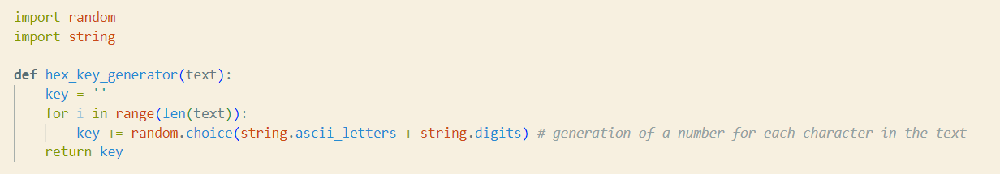
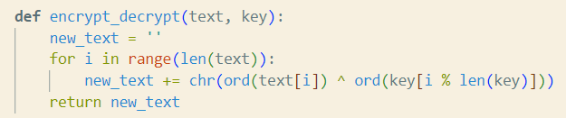
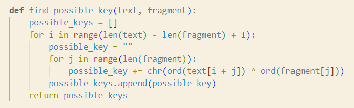
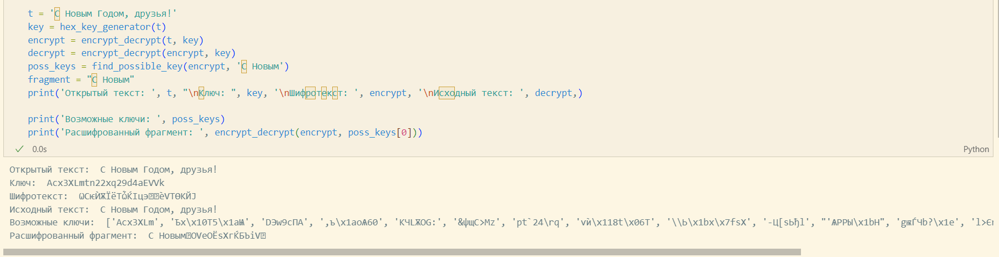

---
## Front matter
lang: ru-RU
title: Lab07
author: |
	Anna D. Zaytseva\inst{1,3}
institute: |
	\inst{1}RUDN University, Moscow, Russian Federation
date: NEC--2024, 19 October, Moscow

## Formatting
toc: false
slide_level: 2
theme: metropolis
header-includes: 
 - \metroset{progressbar=frametitle,sectionpage=progressbar,numbering=fraction}
 - '\makeatletter'
 - '\beamer@ignorenonframefalse'
 - '\makeatother'
aspectratio: 43
section-titles: true
---

# Цель работы

Цель работы --- приобретение пракктических навыков по использованию инструмента Burp Suite.

# Выполнение этапа индивидуального проекта

## Step 1

Я создала функцию для генерации случайного ключа (Рис. [-@fig:001]):

{ #fig:001 width=70% }

## Step 2

Поскольку операция XOR отменяет сама себя, одной функции для шифрования и для дешифрования текста будет достаточно (Рис. [-@fig:002]):

{ #fig:002 width=70% }

## Step 3

Я создала функцию поиска возможных ключей для текстового фрагмента (Рис. [-@fig:003]):

{ #fig:003 width=70% }

## Step 4

Проверка работы всех функций. Шифрование и дешифрование происходит корректно, как и нахождение ключей, с помощью которых можно расшифровать корректно только кусок текста (Рис. [-@fig:004]):

{ #fig:004 width=70% }

# Вывод

Приобрела практический навык по применению метода однократного гаммирования.

# Библиография

* https://xakep.ru/2019/07/18/crypto-xor/
* https://bugtraq.ru/library/books/crypto/chapter7/

## {.standout}

Спасибо за внимание!
