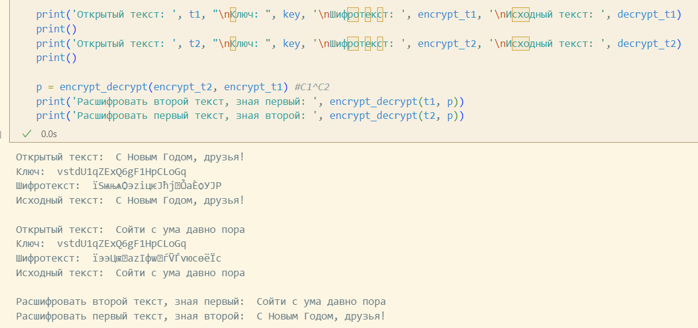

---
## Front matter
lang: ru-RU
title: Lab08
author: |
	Anna D. Zaytseva\inst{1,3}
institute: |
	\inst{1}RUDN University, Moscow, Russian Federation
date: NEC--2024, 26 October, Moscow

## Formatting
toc: false
slide_level: 2
theme: metropolis
header-includes: 
 - \metroset{progressbar=frametitle,sectionpage=progressbar,numbering=fraction}
 - '\makeatletter'
 - '\beamer@ignorenonframefalse'
 - '\makeatother'
aspectratio: 43
section-titles: true
---

# Цель работы

Цель работы --- Освоить на практике применение режима однократного гаммирования на примере кодирования различных исходных текстов одним ключом.

# Выполнение этапа индивидуального проекта

## Step 1

Я выполнила лабораторную работа на языке программирования Python, используя функции, написанные в своей предыдущей работе.

Сперва я использовала функцию для генерации случайного ключа, а потом зашифровала с его помощью два разных текста (Рис. [-@fig:001]):

{ #fig:001 width=70% }

## Step 2

Расшифровала оба текста сначала с помощью одного ключа, затем предположила, что мне неизвестен ключ, но извествен один из текстов, и уже расшифровала второй, зная шифротексты и первый текст (Рис. [-@fig:002]):

{ #fig:002 width=70% }

# Вывод

Приобрела навыки применения режима однократного гаммирования на примере кодирования различных исходных текстов одним ключом.

# Библиография

* https://www.youtube.com/watch?v=tAjBULW_OjQ
* https://bugtraq.ru/library/books/crypto/chapter7/
* https://xakep.ru/2019/07/18/crypto-xor/

## {.standout}

Спасибо за внимание!