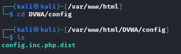

---
## Front matter
lang: ru-RU
title: Ind Project Stage №2
author: |
	Anna D. Zaytseva\inst{1,3}
institute: |
	\inst{1}RUDN University, Moscow, Russian Federation
date: NEC--2024, 21 September, Moscow

## Formatting
toc: false
slide_level: 2
theme: metropolis
header-includes: 
 - \metroset{progressbar=frametitle,sectionpage=progressbar,numbering=fraction}
 - '\makeatletter'
 - '\beamer@ignorenonframefalse'
 - '\makeatother'
aspectratio: 43
section-titles: true
---

# Цель работы

Цель работы --- Установка DVWA.

# Задание

- Установить DVWA в гостевую систему к Kali Linux из репозитория: https://github.com/digininja/DVWA.

# Теоретические выкладки

DVWA - это уязвимое веб-приложение, разработанное на PHP и MYSQL.

Некоторые из уязвимостей веб приложений, который содержит DVWA:
- Брутфорс: Брутфорс HTTP формы страницы входа - используется для тестирования инструментов по атаке на пароль методом грубой силы и показывает небезопасность слабых паролей.
- Исполнение (внедрение) команд: Выполнение команд уровня операционной системы.
- Межсайтовая подделка запроса (CSRF): Позволяет «атакующему» изменить пароль администратора приложений.
- Внедрение (инклуд) файлов: Позволяет «атакующему» присоединить удалённые/локальные файлы в веб приложение.
- SQL внедрение: Позволяет «атакующему» внедрить SQL выражения в HTTP из поля ввода, DVWA включает слепое и основанное на ошибке SQL внедрение.
- Небезопасная выгрузка файлов: Позволяет «атакующему» выгрузить вредоносные файлы на веб сервер.
- Межсайтовый скриптинг (XSS): «Атакующий» может внедрить свои скрипты в веб приложение/базу данных. DVWA включает отражённую и хранимую XSS.
- Пасхальные яйца: раскрытие полных путей, обход аутентификации и некоторые другие.

DVWA имеет четыре уровня безопасности, они меняют уровень безопасности каждого веб приложения в DVWA:
- Невозможный — этот уровень должен быть безопасным от всех уязвимостей. Он используется для сравнения уязвимого исходного кода с безопасным исходным кодом.
- Высокий — это расширение среднего уровня сложности, со смесью более сложных или альтернативных плохих практик в попытке обезопасить код. Уязвимости не позволяют такой простор эксплуатации как на других уровнях.
- Средний — этот уровень безопасности предназначен главным образом для того, чтобы дать пользователю пример плохих практик безопасности, где разработчик попытался сделать приложение безопасным, но потерпел неудачу.
- Низкий — этот уровень безопасности совершенно уязвим и совсем не имеет защиты. Его предназначение быть примером среди уязвимых веб приложений, примером плохих практик программирования и служить платформой обучения базовым техникам эксплуатации.

# Выполнение этапа индивидуального проекта

## Steps 1-6

В установленной при выполнении предыдущего этапа индивидуального проекта операционной системе настроим DVWA.

{ #fig:001 width=70% }

{ #fig:002 width=70% }

{ #fig:003 width=70% }

{ #fig:004 width=70% }

{ #fig:005 width=70% }

{ #fig:006 width=70% }

## Steps 7-9

Настроила базу данных:

{ #fig:007 width=70% }

Для выхода из режима проверки в консоли нажимаю q.

{ #fig:008 width=70% }

{ #fig:009 width=70% }

## Steps 10-12

Настроила сервер apache2:

{ #fig:010 width=70% }

{ #fig:011 width=70% }

{ #fig:012 width=70% }

## Steps 13-14

DVWA, Apache и база данных настроены, поэтому теперь остаётся открыть браузер и запустить веб-приложение, введя в адресной строке 127.0.0.1/DVWA (Рис. [-@fig:013]):

{ #fig:013 width=70% }

{ #fig:014 width=70% }

Но необходимо было авторизоваться с помощью предложенных по умолчанию данных ("admin // password") и оказаться на домашней странице веб-приложения. На этом установка окончена.

# Выводы

Приобрела практические навыки по установке уязвимого веб-приложения DVWA.

# Библиография

1. Методические материалы курса

## {.standout}

Спасибо за внимание!
