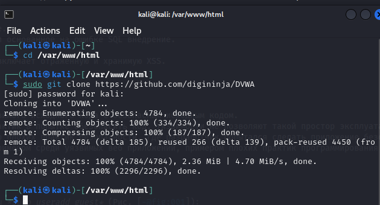
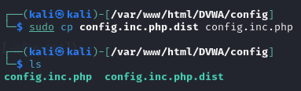
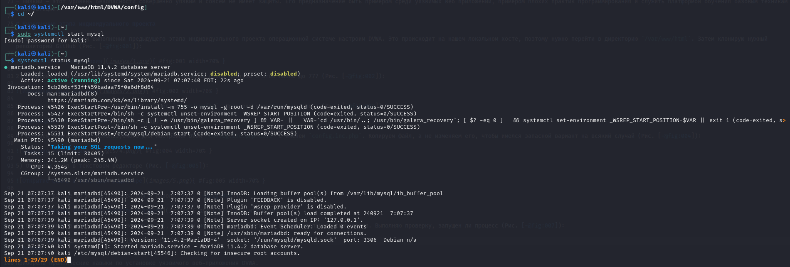
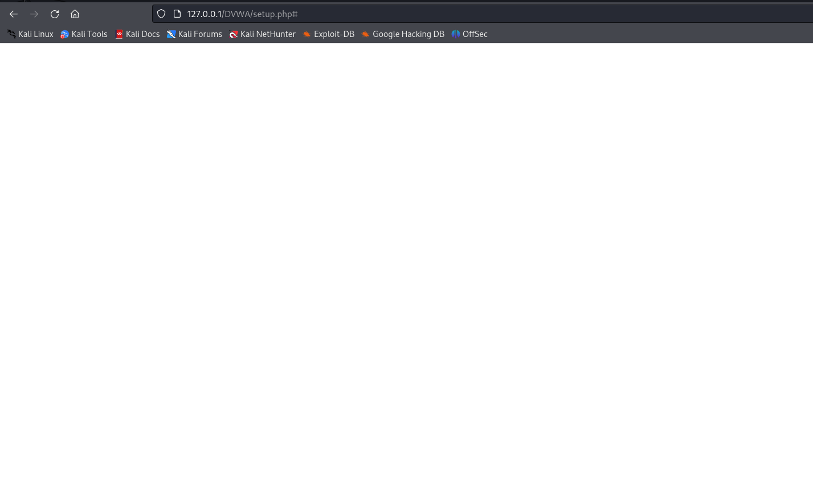

---
## Front matter
title: "Индивидуальный проект. Этап №2"
subtitle: "Отчёт к этапу индивидуального проекта"
author: "Зайцева Анна Дмитриевна, НПМбд-02-21"

## Generic options
lang: ru-RU

## Bibliography
bibliography: bib/cite.bib
csl: pandoc/csl/gost-r-7-0-5-2008-numeric.csl

## Pdf output format
toc: true # Table of contents
toc-depth: 2
lof: true # List of figures
lot: true # List of tables
fontsize: 12pt
linestretch: 1.5
papersize: a4
documentclass: scrreprt
## Fonts
mainfont: PT Serif
romanfont: PT Serif
sansfont: PT Sans
monofont: PT Mono
mainfontoptions: Ligatures=TeX
romanfontoptions: Ligatures=TeX
sansfontoptions: Ligatures=TeX,Scale=MatchLowercase
monofontoptions: Scale=MatchLowercase,Scale=0.9
## Pandoc-crossref LaTeX customization
figureTitle: "Рис."
tableTitle: "Таблица"
listingTitle: "Листинг"
lofTitle: "Список иллюстраций"
lotTitle: "Список таблиц"
lolTitle: "Листинги"
## Misc options
indent: true
header-includes:
  - \usepackage{indentfirst}
  - \usepackage{float} # keep figures where there are in the text
  - \floatplacement{figure}{H} # keep figures where there are in the text
---

# Цель работы

Цель работы --- Установка DVWA.

# Задание

- Установить DVWA в гостевую систему к Kali Linux из репозитория: https://github.com/digininja/DVWA.

# Теоретические выкладки

DVWA - это уязвимое веб-приложение, разработанное на PHP и MYSQL.

Некоторые из уязвимостей веб приложений, который содержит DVWA:
- Брутфорс: Брутфорс HTTP формы страницы входа - используется для тестирования инструментов по атаке на пароль методом грубой силы и показывает небезопасность слабых паролей.
- Исполнение (внедрение) команд: Выполнение команд уровня операционной системы.
- Межсайтовая подделка запроса (CSRF): Позволяет «атакующему» изменить пароль администратора приложений.
- Внедрение (инклуд) файлов: Позволяет «атакующему» присоединить удалённые/локальные файлы в веб приложение.
- SQL внедрение: Позволяет «атакующему» внедрить SQL выражения в HTTP из поля ввода, DVWA включает слепое и основанное на ошибке SQL внедрение.
- Небезопасная выгрузка файлов: Позволяет «атакующему» выгрузить вредоносные файлы на веб сервер.
- Межсайтовый скриптинг (XSS): «Атакующий» может внедрить свои скрипты в веб приложение/базу данных. DVWA включает отражённую и хранимую XSS.
- Пасхальные яйца: раскрытие полных путей, обход аутентификации и некоторые другие.

DVWA имеет четыре уровня безопасности, они меняют уровень безопасности каждого веб приложения в DVWA:
- Невозможный — этот уровень должен быть безопасным от всех уязвимостей. Он используется для сравнения уязвимого исходного кода с безопасным исходным кодом.
- Высокий — это расширение среднего уровня сложности, со смесью более сложных или альтернативных плохих практик в попытке обезопасить код. Уязвимости не позволяют такой простор эксплуатации как на других уровнях.
- Средний — этот уровень безопасности предназначен главным образом для того, чтобы дать пользователю пример плохих практик безопасности, где разработчик попытался сделать приложение безопасным, но потерпел неудачу.
- Низкий — этот уровень безопасности совершенно уязвим и совсем не имеет защиты. Его предназначение быть примером среди уязвимых веб приложений, примером плохих практик программирования и служить платформой обучения базовым техникам эксплуатации.

# Выполнение этапа индивидуального проекта

1) В установленной при выполнении предыдущего этапа индивидуального проекта операционной системе настроим DVWA. Это происходит на нашем локальном хосте, поэтому нужно перейти в директорию `/var/www/html`. Затем клонирую нужный репозиторий GitHub (Рис. [-@fig:001]):

{ #fig:001 width=70% }

2) Проверяю, что файлы склонировались правильно и повышаю права доступа к этой папке до 777 (Рис. [-@fig:002]):

{ #fig:002 width=70% }

3) Для настройки DVWA, нужно перейти в каталог `/dvwa/config`. Проверяю содержимое каталога (Рис. [-@fig:003]):

{ #fig:003 width=70% }

4) Создаем копию файла, используемого для настройки DVWA `config.inc.php.dist` с именем `config.inc.php`. Копируем файл, а не изменяем его, чтобы имелся запасной вариант на всякий случай (Рис. [-@fig:004]):

{ #fig:004 width=70% }

5) Открываю файл в текстовом редакторе (Рис. [-@fig:005]):

{ #fig:005 width=70% }

6) Изменяю данные об имени пользователя и пароле (Рис. [-@fig:006]):

{ #fig:006 width=70% }

7) По умолчанию в Kali Linux установлен mysql, поэтому можно его запустить без предварительного скачивания. Выполняю проверку, запущен ли процесс (Рис. [-@fig:007]):

{ #fig:007 width=70% }

Для выхода из режима проверки в консоли нажимаю q.

8) Авторизуюсь в базе данных от имени пользователя root (с паролем root). Появилась командная строка с приглашением "MariaDB", в которой я создала нового пользователя, используя учётные данные из файла config.inc.php (Рис. [-@fig:008]):

{ #fig:008 width=70% }

9) Теперь предоставим пользователю привилегии для работы с этой базой данных (Рис. [-@fig:009]):

{ #fig:009 width=70% }

10) Необхоимо настроить сервер apache2. Для этого перехожу в соответствующую директорию и открываю файл 'php.ini', чтобы изменить в нём один параметр (Рис. [-@fig:010]):

{ #fig:010 width=70% }

11) В раздееле 'Fopen wrappers' делаем так, чтобы параметры allow-url-fopen и allow-url-include были со значением On (Рис. [-@fig:011]):

{ #fig:011 width=70% }

12) Запускаю службу веб-сервера apache и проверяю, запущена ли она (Рис. [-@fig:012]):

{ #fig:012 width=70% }

13) DVWA, Apache и база данных настроены, поэтому теперь остаётся открыть браузер и запустить веб-приложение, введя в адресной строке 127.0.0.1/DVWA (Рис. [-@fig:013]):

{ #fig:013 width=70% }

14) Нажимаю кнопку Create/Reset Database. У меня появилось пустое окно (Рис. [-@fig:014]):

{ #fig:014 width=70% }

Но необходимо было авторизоваться с помощью предложенных по умолчанию данных ("admin // password") и оказаться на домашней странице веб-приложения. На этом установка окончена.

# Выводы

Приобрела практические навыки по установке уязвимого веб-приложения DVWA.

# Библиография

1. Методические материалы курса
