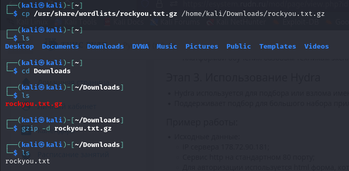
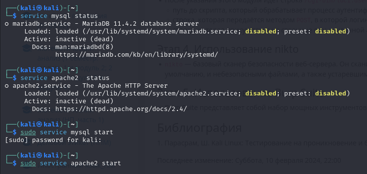
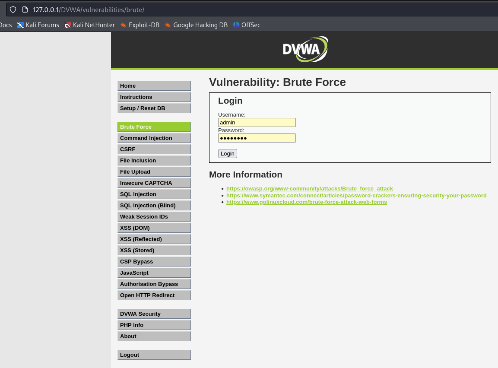
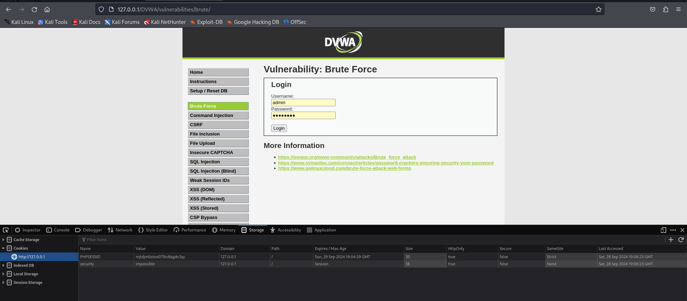
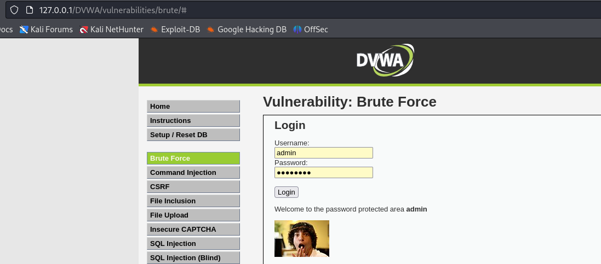

---
## Front matter
title: "Индивидуальный проект. Этап №3"
subtitle: "Отчёт к этапу индивидуального проекта"
author: "Зайцева Анна Дмитриевна, НПМбд-02-21"

## Generic options
lang: ru-RU

## Bibliography
bibliography: bib/cite.bib
csl: pandoc/csl/gost-r-7-0-5-2008-numeric.csl

## Pdf output format
toc: true # Table of contents
toc-depth: 2
lof: true # List of figures
lot: true # List of tables
fontsize: 12pt
linestretch: 1.5
papersize: a4
documentclass: scrreprt
## Fonts
mainfont: PT Serif
romanfont: PT Serif
sansfont: PT Sans
monofont: PT Mono
mainfontoptions: Ligatures=TeX
romanfontoptions: Ligatures=TeX
sansfontoptions: Ligatures=TeX,Scale=MatchLowercase
monofontoptions: Scale=MatchLowercase,Scale=0.9
## Pandoc-crossref LaTeX customization
figureTitle: "Рис."
tableTitle: "Таблица"
listingTitle: "Листинг"
lofTitle: "Список иллюстраций"
lotTitle: "Список таблиц"
lolTitle: "Листинги"
## Misc options
indent: true
header-includes:
  - \usepackage{indentfirst}
  - \usepackage{float} # keep figures where there are in the text
  - \floatplacement{figure}{H} # keep figures where there are in the text
---

# Цель работы

Цель работы --- Приобретение практических навыков по использованию инструмента Hydra для брутфорса (подбора) паролей.

# Выполнение этапа индивидуального проекта

1) Для перебора поаролей мне понадобится файл, содержащий их. Например, находящийся в директории  usr/share/wordlists/ в архиве rockyou.txt.gz. Скопирую архив в директорию Downloads и разархивирую его (Рис. [-@fig:001]):

{ #fig:001 width=70% }

2) Открою в браузере приложение DVWA, но предварительно запущу сервисы MySQL и Apache2 (Рис. [-@fig:002]):

{ #fig:002 width=70% }

3) Форма для взлома находится в разделе Brute Force (Рис. [-@fig:003]):

{ #fig:003 width=70% }

В форме есть два тега: input с атрибутами name, равными 'username' и 'password' соответственно.

4) Также мне понадобятся фрагменты-cookie приложения. Это PHPSESSID и security (Рис. [-@fig:004]):

{ #fig:004 width=70% }

5) Воспользовалась утилитой hydra, введя следующую команду:

```
hydra -l <login> -P <path_to_file> -s <port> <host> http-<method>-form "<url>:username=^USER^&password=^PASS^&Login=Login:H=Cookie:<key=value>;<key=value>:F=<error_message>"
```

где
* login - логин для авторизации (в нашем случае admin)
* path_to_file - путь до файла с паролями (в нашем случае ~/Downloads/rockyou.txt)
* port - порт, по которому доступно приложение (в нашем случае 80)
* host - домен или ip приложения (в нашем случае localhost)
* method - метод запроса (в нашем случае get)
* url - адрес относительно корня сайта (в нашем случае /DVWA/vulnerabilities/brute/)
* key=value - имена и значения cookie-переменных (в нашем случае PHPSESSID и security)
* error_message - сообщение, выводимое при неверных логине и пароле (в нашем случае Username and/or password incorrect.)

Итоговая команда имеет следующие опции:

```
hydra -l admin -P ~/Downloads/rockyou.txt -s 80 localhost http-get-form "/DVWA/vulnerabilities/brute/:username=^USER^&password=^PASS^&Login=Login:H=Cookie:security=medium;PHPSESSID=of74bg222ffc6vigcsjfqbvhq7:F=Username and/or password incorrect."
```

6) Утилита подобрала данные для ввода (Рис. [-@fig:005]):

{ #fig:005 width=70% }

7) Ввела данные в соответствующее поле. Операция прошла успешно (Рис. [-@fig:006]):

{ #fig:006 width=70% }

# Вывод

Приобрела практический навык по использованию инструмента Hydra для брутфорса (подбора) паролей.

# Библиография

* https://github.com/digininja/DVWA?tab=readme-ov-file
* https://www.kali.org/
* https://spy-soft.net/rockyou-txt/
* https://losst.pro/kak-polzovatsya-hydra#perebor-parolya-autentifikcii-http
