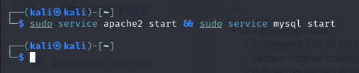
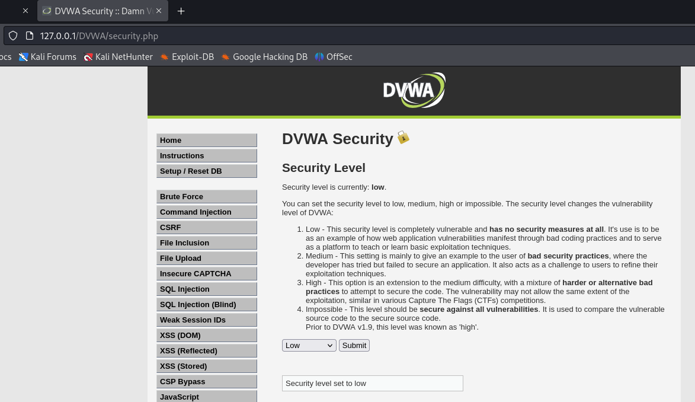
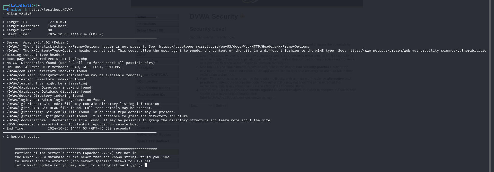
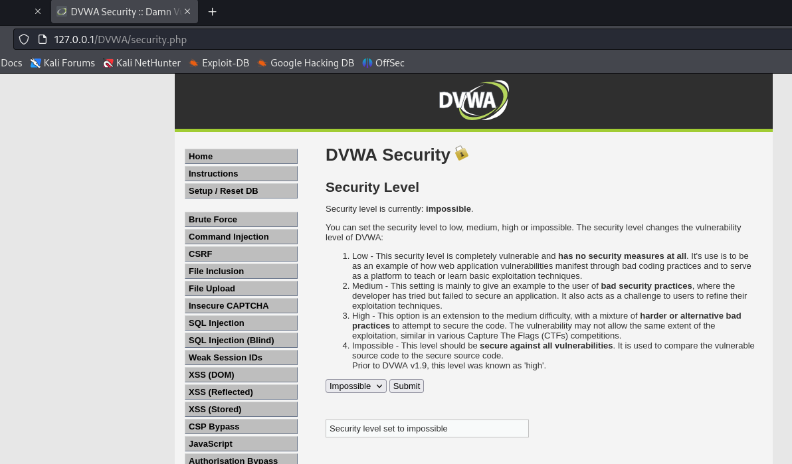
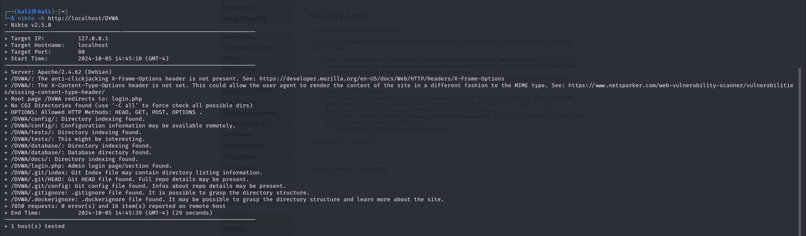

---
## Front matter
title: "Индивидуальный проект. Этап №4"
subtitle: "Отчёт к этапу индивидуального проекта"
author: "Зайцева Анна Дмитриевна, НПМбд-02-21"

## Generic options
lang: ru-RU

## Bibliography
bibliography: bib/cite.bib
csl: pandoc/csl/gost-r-7-0-5-2008-numeric.csl

## Pdf output format
toc: true # Table of contents
toc-depth: 2
lof: true # List of figures
lot: true # List of tables
fontsize: 12pt
linestretch: 1.5
papersize: a4
documentclass: scrreprt
## Fonts
mainfont: PT Serif
romanfont: PT Serif
sansfont: PT Sans
monofont: PT Mono
mainfontoptions: Ligatures=TeX
romanfontoptions: Ligatures=TeX
sansfontoptions: Ligatures=TeX,Scale=MatchLowercase
monofontoptions: Scale=MatchLowercase,Scale=0.9
## Pandoc-crossref LaTeX customization
figureTitle: "Рис."
tableTitle: "Таблица"
listingTitle: "Листинг"
lofTitle: "Список иллюстраций"
lotTitle: "Список таблиц"
lolTitle: "Листинги"
## Misc options
indent: true
header-includes:
  - \usepackage{indentfirst}
  - \usepackage{float} # keep figures where there are in the text
  - \floatplacement{figure}{H} # keep figures where there are in the text
---

# Цель работы

Цель работы --- приобретение пракктических навыков по использованию инструмента nikto — базового сканера безопасности веб-сервера. Он сканирует и обнаруживает уязвимости в веб-приложениях, обычно вызванные неправильной конфигурацией на самом сервере, файлами, установленными по умолчанию, и небезопасными файлами, а также устаревшими серверными приложениями.

# Выполнение этапа индивидуального проекта

1) Запущу сервисы MySQL и Apache2 (Рис. [-@fig:001]):

{ #fig:001 width=70% }

2) В приложении DVWA захожу в раздел ```DVWA Security``` и выбираю функцию "Low" (Рис. [-@fig:002]):

{ #fig:002 width=70% }

3) Воспользовалась утилитой nikto: (Рис. [-@fig:003]):

```
nikto -h <host or ip>
```

{ #fig:003 width=70% }

4) Для эксперимента сменила настройку защиты в DVWA на "Impossible" (Рис. [-@fig:004]):

{ #fig:004 width=70% }

5) Запустила повторно утилиту nikto: (Рис. [-@fig:005]):

{ #fig:005 width=70% }

6) Вывод утилиты не изменился. Далее привожу анализ вывода:

* Server: Apache/2.4.62 (Debian)

* /DVWA/: The anti-clickjacking X-Frame-Options header is not present. See: https://developer.mozilla.org/en-US/docs/Web/HTTP/Headers/X-Frame-Options

Отсутствие заголовка X-Frame-Options сигнализирует о том, что сайт может быть подвержен атаке clickjacking. Кликджекинг — это атака на основе интерфейса, при которой пользователя обманным путем заставляют щелкнуть активный контент на скрытом веб-сайте, щелкнув другой контент на ложном веб-сайте.

* /DVWA/: The X-Content-Type-Options header is not set. This could allow the user agent to render the content of the site in a different fashion to the MIME type. See: https://www.netsparker.com/web-vulnerability-scanner/vulnerabilities/missing-content-type-header/

Если заголовок X-Frame-Options не установлен, это может привести к тому, что старые версии Chrome и Internet Explorer будут выполнять MIME-анализ тела ответа. И это может закончиться тем, что тело ответа будет интерпретировано и отображено как тип контента, отличный от объявленного.

* Root page /DVWA redirects to: login.php

Иллюстрация имени скрипта авторизации.

* OPTIONS: Allowed HTTP Methods: HEAD, GET, POST, OPTIONS .

У эндпоинта есть несколько методов.

* /DVWA/config/: Directory indexing found.

Обнаружена индексация каталогов.

* /DVWA/config/: Configuration information may be available remotely.

Найден эндпоинт, по которому может содержаться информация по конфигурации.

* /DVWA/tests/: Directory indexing found.

Обнаружена индексация каталогов.

* /DVWA/tests/: This might be interesting.

Найдена папка с тестами: это может быть полезно.

* /DVWA/database/: Directory indexing found.

Обнаружена индексация каталогов.

* /DVWA/database/: Database directory found.

Обнаружена директория, содержащая информацию о базе данных.

* /DVWA/docs/: Directory indexing found.

Обнаружена индексация каталогов.

* /DVWA/login.php: Admin login page/section found.

Найден эндпоинт для входа в панель админа.

* /DVWA/.git/index: Git Index file may contain directory listing information.

* /DVWA/.git/HEAD: Git HEAD file found. Full repo details may be present.

* /DVWA/.git/config: Git config file found. Infos about repo details may be present.

* /DVWA/.gitignore: .gitignore file found. It is possible to grasp the directory structure.

Найдена информация о системе контроля версий.

* /DVWA/.dockerignore: .dockerignore file found. It may be possible to grasp the directory structure and learn more about the site.

Файл .dockerignore содержит список файлов и папок, которые могут быть исключены при сборке образов Docker для развертывания в контейнерах.

* 7850 requests: 0 error(s) and 16 item(s) reported on remote host

* End Time:           2024-10-05 14:45:39 (GMT-4) (29 seconds)

# Вывод

Приобрела практический навык по использованию инструмента nikto - базового сканера безопасности веб-сервера.

# Библиография

* https://github.com/digininja/DVWA?tab=readme-ov-file
* https://www.kali.org/
* https://www.kali.org/tools/nikto/
* https://habr.com/ru/companies/otus/articles/492546/
