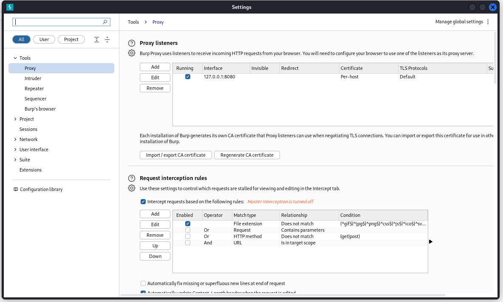
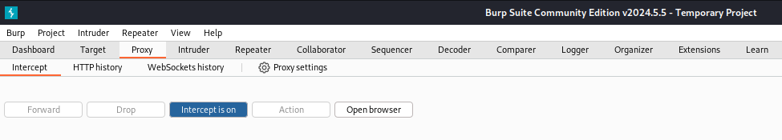
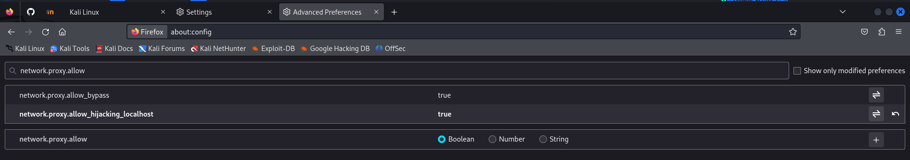
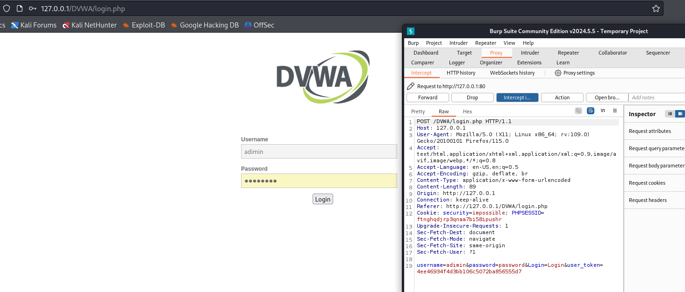
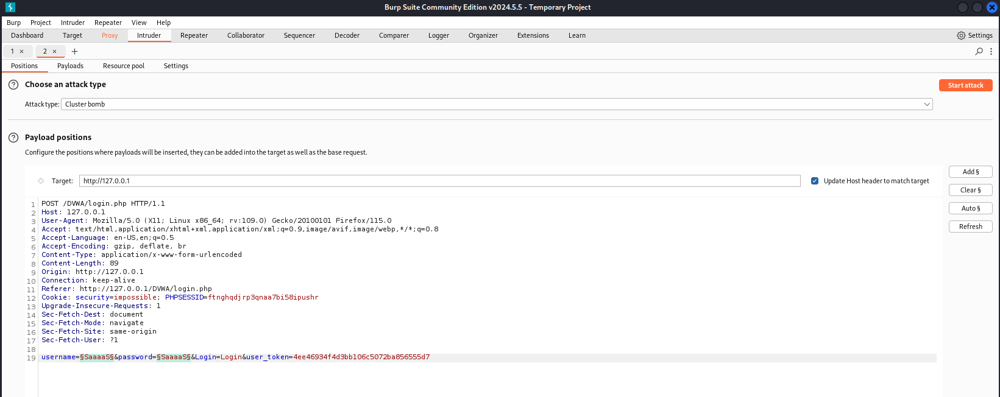
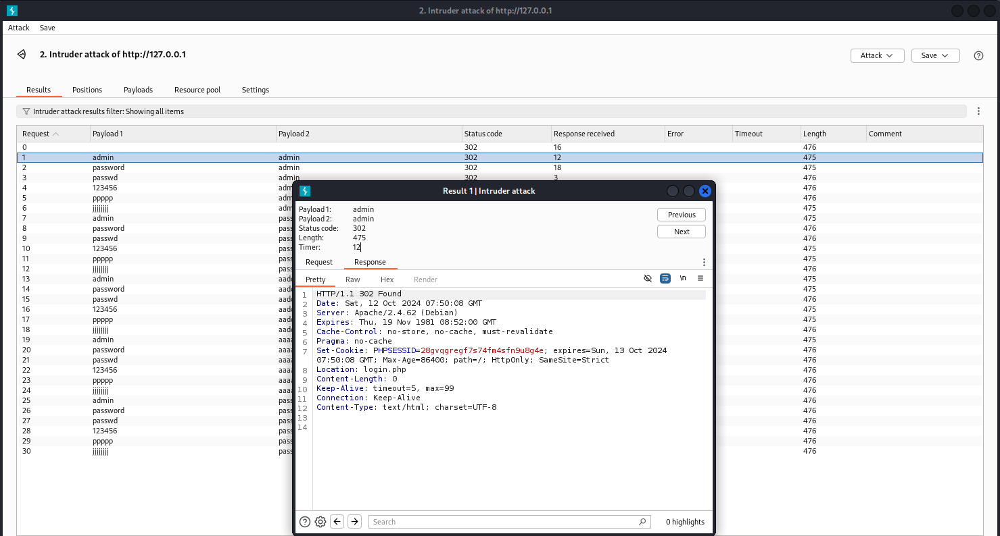
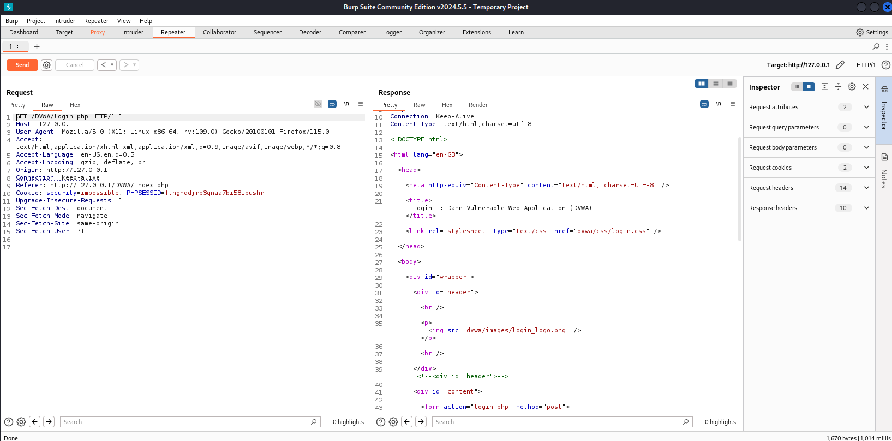

---
## Front matter
lang: ru-RU
title: Ind Project Stage №5
author: |
	Anna D. Zaytseva\inst{1,3}
institute: |
	\inst{1}RUDN University, Moscow, Russian Federation
date: NEC--2024, 12 October, Moscow

## Formatting
toc: false
slide_level: 2
theme: metropolis
header-includes: 
 - \metroset{progressbar=frametitle,sectionpage=progressbar,numbering=fraction}
 - '\makeatletter'
 - '\beamer@ignorenonframefalse'
 - '\makeatother'
aspectratio: 43
section-titles: true
---

# Цель работы

Цель работы --- приобретение пракктических навыков по использованию инструмента Burp Suite.

# Выполнение этапа индивидуального проекта

## Steps 1-7

Подготовка к использованию Burp Suite:

{ #fig:001 width=70% }

{ #fig:002 width=70% }

{ #fig:003 width=70% }

{ #fig:004 width=70% }

{ #fig:005 width=70% }

{ #fig:006 width=70% }

{ #fig:007 width=70% }

## Steps 8-11

Работа с Burp Suite - захват запроса:

{ #fig:008 width=70% }

{ #fig:009 width=70% }

{ #fig:010 width=70% }

{ #fig:011 width=70% }

## Steps 12-17

Подготовка к атаке и сама атака (подбор логина и пароля для входа в DVWA):

{ #fig:012 width=70% }

{ #fig:013 width=70% }

{ #fig:014 width=70% }

{ #fig:015 width=70% }

{ #fig:016 width=70% }

{ #fig:017 width=70% }

## Steps 18-23

Анализ полученных результатов атаки:

{ #fig:018 width=70% }

{ #fig:019 width=70% }

{ #fig:020 width=70% }

{ #fig:021 width=70% }

{ #fig:022 width=70% }

{ #fig:023 width=70% }

# Вывод

Приобрела практический навык по использованию инструмента Burp Suite.

# Библиография

* https://www.kaznu.kz/content/files/news/folder23191/%D0%9B%D0%B5%D0%BA%D1%86%D0%B8%D1%8F%2012%20rus.pdf
* https://esystem.rudn.ru/mod/page/view.php?id=1140635

## {.standout}

Спасибо за внимание!
