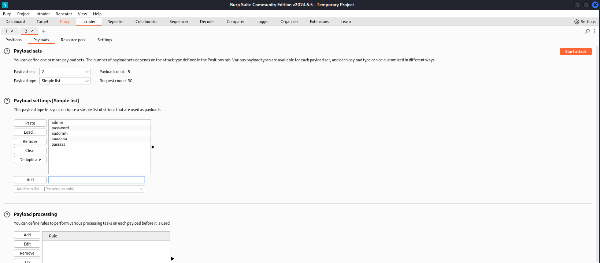

---
## Front matter
title: "Индивидуальный проект. Этап №5"
subtitle: "Отчёт к этапу индивидуального проекта"
author: "Зайцева Анна Дмитриевна, НПМбд-02-21"

## Generic options
lang: ru-RU

## Bibliography
bibliography: bib/cite.bib
csl: pandoc/csl/gost-r-7-0-5-2008-numeric.csl

## Pdf output format
toc: true # Table of contents
toc-depth: 2
lof: true # List of figures
lot: true # List of tables
fontsize: 12pt
linestretch: 1.5
papersize: a4
documentclass: scrreprt
## Fonts
mainfont: PT Serif
romanfont: PT Serif
sansfont: PT Sans
monofont: PT Mono
mainfontoptions: Ligatures=TeX
romanfontoptions: Ligatures=TeX
sansfontoptions: Ligatures=TeX,Scale=MatchLowercase
monofontoptions: Scale=MatchLowercase,Scale=0.9
## Pandoc-crossref LaTeX customization
figureTitle: "Рис."
tableTitle: "Таблица"
listingTitle: "Листинг"
lofTitle: "Список иллюстраций"
lotTitle: "Список таблиц"
lolTitle: "Листинги"
## Misc options
indent: true
header-includes:
  - \usepackage{indentfirst}
  - \usepackage{float} # keep figures where there are in the text
  - \floatplacement{figure}{H} # keep figures where there are in the text
---

# Цель работы

Цель работы --- приобретение пракктических навыков по использованию инструмента Burp Suite.

# Теоретическая выкладка

Burp Suite представляет собой набор мощных инструментов безопасности веб-приложений, которые демонстрируют реальные возможности злоумышленника, проникающего в веб-приложения. Эти инструменты позволяют сканировать, 
анализировать и использовать веб-приложения с помощью ручных и автоматических методов. Интеграция интерфейсов этих инструментов обеспечивает полную платформу атаки для обмена информацией между одним или несколькими инструментами, что делает Burp Suite очень эффективной и простой в использовании платформой для атаки веб-приложений.

# Выполнение этапа индивидуального проекта

1) Запущу сервисы MySQL и Apache2 (Рис. [-@fig:001]):

{ #fig:001 width=70% }

2) Запускаю инструмент Burp Suite (Рис. [-@fig:002]):

{ #fig:002 width=70% }

3) Открываю сетевые настройки в браузере, чтобы подготовиться к выполнению основной части работы (Рис. [-@fig:003]):

{ #fig:003 width=70% }

4) Изменяю настройки сервера для работы с proxy и захватом через Burp Suite (Рис. [-@fig:004]):

{ #fig:004 width=70% }

5) Изменяю настройки proxy в Burp Suite (Рис. [-@fig:005]):

{ #fig:005 width=70% }

6) Включаю interception во вкладке Proxy в Burp Suite (Рис. [-@fig:006]):

{ #fig:006 width=70% }

7) Для исправной работы Burp Suite с локальным сервером необходимо установить параметр `network_allow_hijacking_localhost` на значение `true` (Рис. [-@fig:007]):

{ #fig:007 width=70% }

8) Я попыталась зайти в браузере в DVWA, и в этот момент во вкладке Proxy появился захваченный запрос. Нажала "Forward" для загрузки страницы (Рис. [-@fig:008]):

{ #fig:008 width=70% }

9) Страница загрузилась, а именно -- страница аторизации, текст запроса изменился (Рис. [-@fig:009]):

{ #fig:009 width=70% }

10) Во вкладке Target хранится история запросов (Рис. [-@fig:010]):

{ #fig:010 width=70% }

11) Я попробовала ввести неправильные, случайные данные в DVWA, и нажала на кнопку "Login". В запросе в Burp Suite увидела строку, в которой отображаются все введенные мной данные (данные поля для ввода) (Рис. [-@fig:011]):

{ #fig:011 width=70% }

12) Этот запрос также присутствует во вкладке Target. Там же я нажала правой кнопкой мыши на хост нужного запроса и выбрала `Send to Intruder` (Рис. [-@fig:012]):

{ #fig:012 width=70% }

13) Перешла во вкладку "Intruder", и в ней отобразился отправленный в неё запрос. По умолчанию у типа атаки стоит "Sniper" (Рис. [-@fig:013]):

{ #fig:013 width=70% }

14) Меняю тип атаки на "Claster bomb" и проставляю специальные символы у тех данных, которые были в форме ввода для логина, которые буду пробивать (содержимое имени пользователя и пароль) (Рис. [-@fig:014]):

{ #fig:014 width=70% }

15) Поскольку я отметила два поля для подбора, мне нужно заполнить два списка `Payload settings` значениями для подбора. Первый (Рис. [-@fig:015]):

{ #fig:015 width=70% }

16) Второй (Рис. [-@fig:016]):

{ #fig:016 width=70% }

В строке "Request count" высвечивается количество всех возможных пар элементов из двух заполненных мной списков.

17) Запустила атаку. Подбор начался (Рис. [-@fig:017]):

{ #fig:017 width=70% }

18) При открытии каждого из ответов на post-запрос можно увидеть полученный get-запрос, в котором есть информация о том, куда я была перенаправлена после ввода пары значений (имени пользователя и пароля). В данном случае пара admin-admin была перенаправлена на login.php, что означает, что пара не подошла (Рис. [-@fig:018]):

{ #fig:018 width=70% }

19) А вот пара admin-password была перенаправлена на index.php что означает, что пара подошла (Рис. [-@fig:019]):

{ #fig:019 width=70% }

20) Для дополнительной проверки с использованием Repeater выбираю запрос admin-password, нажимаю на него правой кнопкой мыши и далее выбираю `Send to Repeater`. Перехожу во вкладку Repeater (Рис. [-@fig:020]):

{ #fig:020 width=70% }

21) Нажимаю кнопку "Send", и во вкладке Response виден результат: перенаправление на index.php (Рис. [-@fig:021]):

{ #fig:021 width=70% }

22) Нажимаю кнопку "Follow redirection", и во вкладке Response виден результат: нескомпилированный HTML-код в окне Response (Рис. [-@fig:022]):

{ #fig:022 width=70% }

23) В подокне "Render" выводится то, как выглядит та страница, на которую я была перенаправлена (полученная страница, HTML-код которой мы видели) (Рис. [-@fig:023]):

{ #fig:023 width=70% }

# Вывод

Приобрела практический навык по использованию инструмента Burp Suite.

# Библиография

* https://www.kaznu.kz/content/files/news/folder23191/%D0%9B%D0%B5%D0%BA%D1%86%D0%B8%D1%8F%2012%20rus.pdf
* https://esystem.rudn.ru/mod/page/view.php?id=1140635
